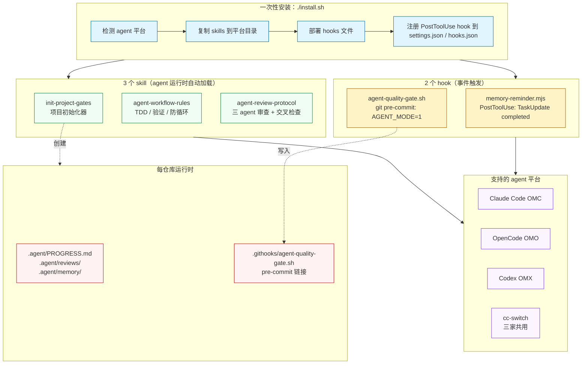
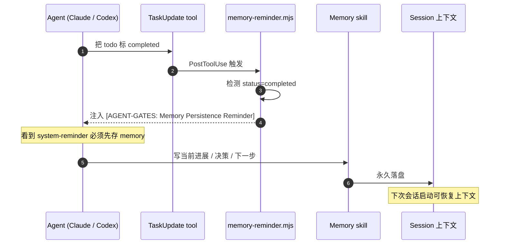
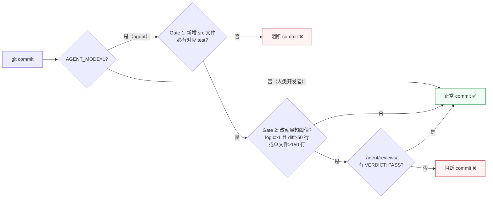
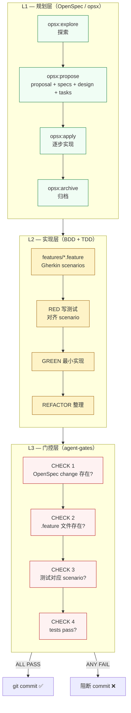
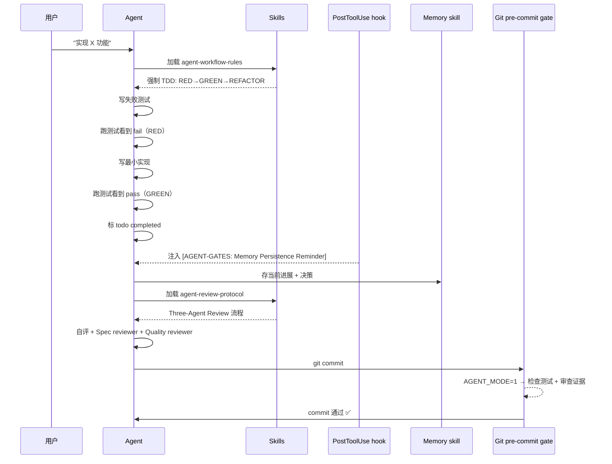

# agent-gates 是什么

> 跨平台 AI agent 的**工程纪律运行时执行层**（runtime gate layer）。一次安装，让 Claude Code / OpenCode / Codex 三个 agent 平台同时获得 TDD 守门、交叉审查证据检查、Memory 持久化提醒、commit 质量门控。

---

## 1. 解决了什么问题

LLM agent 写代码很快，但很容易：

- 跳过 TDD，先写实现再补测试（甚至不补）
- 自评"已完成"——但没真的跑过验证命令
- 修 bug 修不动了开始瞎试，没有 stop-and-rethink 信号
- todo 完成了但 session 一中断上下文全丢，下次接续从零开始
- commit 把无关改动一起带进来，单 PR 几十文件
- 多 agent 平台各自一套规则，跨平台一致性靠人工

**单纯写在 prompt 里的规则没用** —— agent 读完就忘，没有"刹车"。需要的是 **运行时强制点**（hook + 门控），让违规行为出错而不是滑过去。

agent-gates 就是这一层：把工程纪律编码成 **三个 skill + 两个 hook + 一个项目模板**，配套自动安装器（install.sh）、自检工具（doctor.sh）、卸载器（uninstall.sh）。

---

## 2. 整体架构



---

## 3. 三大支柱怎么工作

### 支柱一：runtime skill 注入工程纪律

agent 在打开 IDE / 启动会话时，自动加载下面三个 skill 的 SKILL.md。这些 markdown 文件里写的是 **行为规则**（TDD 必走 RED→GREEN、3 次失败强制 stop、commit 前必跑测试……），agent 通过 system prompt 把它们当硬约束执行。

| Skill | 触发时机 | 强制内容 |
|---|---|---|
| `init-project-gates` | 用户喊"初始化项目" / "init project gates" | 创建 `.agent/` 目录 + 装 pre-commit hook + 生成 AGENTS.md |
| `agent-workflow-rules` | 写代码 / 修 bug / 重构 | TDD 三阶段、计划评审门控、3-strike 防循环、verification-before-completion |
| `agent-review-protocol` | 实现完成、走交叉审查 | Three-Agent Review 流水线、严重性分级、再审防环规则 |

### 支柱二：PostToolUse hook 守 Memory 持久化



**关键点**：hook 是平台原生 PostToolUse 事件（OMC 在 `~/.claude/settings.json` 注册、OMX 在 `~/.codex/hooks.json` 注册），agent 没法绕过。validator 拒绝输出 schema 不合规的 hook 响应——v1.2.1 修过这个静默 fail 的 bug。

### 支柱三：git pre-commit gate 守 commit 质量



**核心设计**：这个 gate **只约束 agent**，不影响人类开发者。通过 `AGENT_MODE=1` 环境变量区分。Agent 想 commit 必须先有测试 + 跨 agent 审查证据；人类开发者照常提交。

---

## 4. 依赖什么

| 依赖 | 必需性 | 用途 |
|---|---|---|
| Node.js ≥ 18 | **必需** | 跑 `memory-reminder.mjs`（ES modules + `node:fs`） |
| `git` 或 `curl` | **必需** | install.sh 拉取仓库 |
| `bash` | **必需** | install.sh / doctor.sh / agent-quality-gate.sh |
| `jq` | 推荐 | 安全 merge `hooks.json` / `settings.json`；缺了改走手动 |
| Memory 类 skill（`memory` / `writer-memory` 等） | 推荐 | hook 提醒 agent 存档，没装也能跑但 reminder 只有信息意义 |
| 至少一个 agent 平台 | 推荐 | OMC / OMO / OMX / cc-switch；install.sh 自动检测 |

> ⚠️ 注意：`$HOME` 路径**不能含空格**——shell hook 无法可靠转义。

---

## 5. 与 agent-superpowers / OpenSpec 的关系

> 这个工具不是凭空冒出来的。它是 2026-05-18 那份《**BDD + CLI Gate + OpenSpec 整合方案**》（本地 Vault：`Wiki/04_Knowledge/AI/Agent/编码助手/BDD-CLI-Gate-OpenSpec整合方案.md`）里 L3 加部分 L2 的工程化落地。

整合方案的核心论点是：纯 prompt 约束不够，必须**让代码（而非提示词）成为最终裁判**。方案分三层：



### agent-gates 在方案里的位置

| 层 | 方案设计 | agent-gates 当前实现 | 状态 |
|---|---|---|---|
| L1 OpenSpec | spec-first 工作流 + `.opencode/skills/openspec-*` | 通过全局 `10-workflow.md` 路径 A 描述；本仓库**不安装** opsx | 全局规则已对齐，工具 standalone |
| L2 BDD | `features/*.feature` Gherkin 验收 | 全局 `10-workflow.md` §BDD Gherkin 要求已声明；本仓库**未强制**生成 | 规范已落，未强制 |
| L2 TDD | RED→GREEN→REFACTOR | `agent-workflow-rules` skill §标准 TDD 流程强制约束 | ✅ 已实现 |
| L2 Three-Agent Review | 自评 + Spec + Quality 三角色 | `agent-review-protocol` skill 落地 | ✅ 已实现 |
| L3 CHECK 1 OpenSpec | 检查 `openspec/changes/<name>/` 存在 | `agent-quality-gate.sh` v1.3 **未实现** | ⏳ 计划中 |
| L3 CHECK 2 BDD | 检查 `features/*.feature` 存在 | 未实现 | ⏳ 计划中 |
| L3 CHECK 3 测试对应 | 新增 src 必有对应 test 文件 | Gate 1 ✅ 已实现（多语言：ts/js/py/java/kt/go） | ✅ |
| L3 CHECK 4 tests pass | 跑测试 | 设计文档明确不在 hook 里执行（CI 负责）；agent-gates 改用 **Gate 2 — Cross-Review 证据**作为替代质量门 | ✅ 已替换实现 |
| L3 隐形依赖 | Memory persistence | `memory-reminder.mjs` PostToolUse hook（方案文档未提，agent-gates 自加） | ✅ 已实现（v1.2.1） |
| L3 部署健康检查 | （方案未涵盖） | `doctor.sh`（v1.3.0 加入，v1.3.1 加强） | ✅ 已实现 |

### 跟 agent-superpowers 怎么比

agent-superpowers 是 **L2 纪律规则的另一种交付形态**——它把规则做成一个 SKILL.md + 一段 AGENTS.md snippet，靠 agent 自觉遵守。agent-gates 与它**并列存在**，但解决的问题更进一步：

| 维度 | agent-superpowers | agent-gates |
|---|---|---|
| 形态 | 单一 skill + AGENTS.md 注入 | 跨平台 installer + 多 skill + hook + 模板 |
| 强制层 | 仅 L2（提示词约束） | L2（skill 约束）+ L3（git pre-commit 硬阻断） |
| 多 agent 平台 | 任意支持 SKILL.md 的 agent | OMC / OMO / OMX / cc-switch 都装，hook 统一注册 |
| Memory 持久化 | 不管 | PostToolUse hook 主动注入 reminder |
| 与 OpenSpec 协同 | 不挂钩 | gate 设计预留 OpenSpec / BDD 检查口（待实现） |
| 自检工具 | 无 | `doctor.sh` |

**一句话总结**：
- **OpenSpec** = L1 规划层（说要做什么、为什么、怎么验收）
- **agent-superpowers** = L2 的纯 prompt 版本（轻量、靠 agent 自觉）
- **agent-gates** = L2（skill 约束）+ L3（CLI gate 硬阻断）的工程化落地，是上面那份整合方案的执行端实现

### 还没做的部分

按整合方案设计，agent-gates 后续要补：

1. `agent-quality-gate.sh` 加 **CHECK 1**：项目有 `openspec/` 时检查活跃 change 存在（无活跃 change + 非 trivial 变更 → WARN/FAIL）
2. `agent-quality-gate.sh` 加 **CHECK 2**：检测到新增功能文件且无对应 `features/*.feature` → FAIL
3. `init-project-gates` skill 加 `features/` 目录脚手架 + step_definitions 多语言模板
4. `doctor.sh` 加 `check_openspec_install`（团队项目）和 `check_bdd_features_dir`
5. `install.sh` 增加 `--with-openspec` 标志，自动调 `openspec init`

这些是 v1.4+ 的方向。在那之前，全局 `10-workflow.md` 已经先把规则写好（路径 A / 团队项目），agent 在团队项目里**应当**按 OpenSpec 走，只是 agent-gates 的硬 gate 还没把这一层卡死。

---

## 6. 如何使用

### 6.1 一行装好

```bash
curl -fsSL https://raw.githubusercontent.com/mcdowell8023/agent-gates/main/install.sh | bash
```

或克隆后装：

```bash
git clone https://github.com/mcdowell8023/agent-gates.git
cd agent-gates && ./install.sh
```

安装器会：
1. 检测 agent 平台（OMC / OMO / OMX / cc-switch），找不到就装到默认 `~/.claude/skills/`
2. 复制 3 个 skill 到对应平台的 skills 目录
3. 部署 hook 文件到 `~/.agent-gates/hooks/`
4. 注册 PostToolUse hook 到平台 settings.json / hooks.json（OMO 当前打印手动指引）
5. 部署 doctor.sh 自检工具到 `~/.agent-gates/doctor.sh`

### 6.2 装完体检

```bash
~/.agent-gates/doctor.sh
```

输出示例：

```
✓ node v26.0.0
✓ jq jq-1.8.1
✓ Memory skill detected: ~/.cc-switch/skills/memory-1.0.2
✓ installed version: 1.3.1
✓ up to date with remote (1.3.1)
✓ memory-reminder.mjs present
✓ agent-quality-gate.sh present (executable)
✓ OMC settings.json hook registered (matcher contains TaskUpdate)
✓ OMO hooks.json hook registered
✓ OMX hooks.json hook registered
✓ hook output schema valid
✓ no memory-reminder hook errors in last-7d transcripts

11 pass · 0 warn · 0 fail
```

退出码：**0 = 无 FAIL（允许 WARN）；1 = 有 FAIL**——CI 友好。
标志：`--quiet`（只显示汇总）/ `--no-network`（离线模式）/ `--help`。

### 6.3 在项目里启用

任意一个 git 仓库内，告诉 agent：

```
初始化项目
```

agent 会调用 `init-project-gates` skill，自动：

1. 创建 `.agent/` 目录（含 PROGRESS.md / GATES.md / reviews/ / plans/ / memory/）
2. 装 pre-commit hook 到 `.githooks/agent-quality-gate.sh`
3. 生成 AGENTS.md 层级（调 deepinit）
4. 注入工作流规则到项目 CLAUDE.md

之后 agent 在这个仓库里写代码会自动遵守 TDD、verification、cross-review 等约束；commit 会被 pre-commit gate 检查。

### 6.4 端到端流程



---

## 7. 关键文件 / 目录

```
~/.agent-gates/                          # 全局安装位置
├── .version                             # 1.3.1
├── doctor.sh                            # 体检工具
└── hooks/
    ├── platform/memory-reminder.mjs     # PostToolUse hook
    └── git/agent-quality-gate.sh        # 项目 pre-commit 母版

~/.claude/skills/                        # OMC skills（或对应平台路径）
├── init-project-gates/SKILL.md
├── agent-workflow-rules/SKILL.md
└── agent-review-protocol/SKILL.md

~/.claude/settings.json                  # 注册 hook：
                                         # .hooks.PostToolUse[].command
                                         # 指向 ~/.agent-gates/hooks/platform/memory-reminder.mjs

<project>/.agent/                        # 仓库内（init-project-gates 创建）
├── PROGRESS.md                          # Sprint 进度（git 跟踪）
├── GATES.md                             # 质量门 checklist
├── reviews/                             # 交叉审查证据（git 跟踪）
├── plans/                               # 实现计划（git 跟踪）
└── memory/                              # 会话 memory（.gitignored）

<project>/.githooks/agent-quality-gate.sh  # pre-commit hook copy
```

---

## 8. Troubleshooting 速查

| 症状 | 多半是 | 怎么修 |
|---|---|---|
| `node not found` | Node.js 不在 PATH | 装 Node ≥ 18 |
| Hook 触发了但 Memory 没存 | 没装 Memory skill | 在任意 skills 目录装一个 memory 类 skill |
| 升级了 agent-gates 但仓库行为没变 | per-project hook 不会自动升级 | 在该仓库 `init project gates` 重跑 |
| OMC matcher 不含 TaskUpdate | install.sh 没装到位 | `~/.agent-gates/doctor.sh` 会标 FAIL；重跑 `install.sh --force` |
| hooks.json 出现重复条目 | 手动改过 + 多次跑 installer | `./uninstall.sh && ./install.sh` |

更完整列表见 [README.md → Troubleshooting](../README.md#troubleshooting)。

---

## 9. 资源

- GitHub: <https://github.com/mcdowell8023/agent-gates>
- 当前版本：v1.3.1（2026-05-22）
- 许可：MIT
- 平台 hook 协议详解：[docs/platform-hooks.md](./platform-hooks.md)
- 体检工具：`~/.agent-gates/doctor.sh --help`

> 这份说明同步落在本地 Obsidian Vault：`Wiki/04_Knowledge/AI/Agent/agent-gates.md`。
